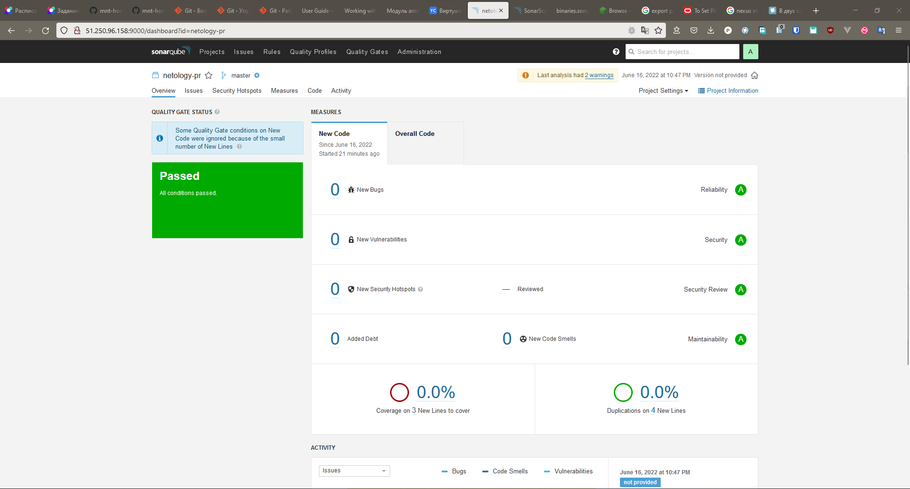

# Результаты домашнего задания "9.3 CI\CD"

## Подготовка к выполнению

- :white_check_mark: Создаём 2 VM в yandex cloud со следующими параметрами: 2CPU 4RAM Centos7(остальное по минимальным требованиям)
- :white_check_mark: Прописываем в [inventory](./infrastructure/inventory/cicd/hosts.yml) [playbook'a](./infrastructure/site.yml) созданные хосты
- :white_check_mark: Добавляем в [files](./infrastructure/files/) файл со своим публичным ключом (id_rsa.pub). Если ключ называется иначе - найдите таску в плейбуке, которая использует id_rsa.pub имя и исправьте на своё
- :white_check_mark: Запускаем playbook, ожидаем успешного завершения
- :white_check_mark: Проверяем готовность Sonarqube через [браузер](http://localhost:9000)
- :white_check_mark: Заходим под admin\admin, меняем пароль на свой
- :white_check_mark: Проверяем готовность Nexus через [бразуер](http://localhost:8081)
- :white_check_mark: Подключаемся под admin\admin123, меняем пароль, сохраняем анонимный доступ

## Знакомоство с SonarQube

### Основная часть

- :white_check_mark: Создаём новый проект, название произвольное
- :white_check_mark: Скачиваем пакет sonar-scanner, который нам предлагает скачать сам sonarqube
- :white_check_mark: Делаем так, чтобы binary был доступен через вызов в shell (или меняем переменную PATH или любой другой удобный вам способ)
- :white_check_mark: Проверяем `sonar-scanner --version`
- :white_check_mark: Запускаем анализатор против кода из директории [example](./example) с дополнительным ключом `-Dsonar.coverage.exclusions=fail.py`
- :white_check_mark: Смотрим результат в интерфейсе
- :white_check_mark: Исправляем ошибки, которые он выявил(включая warnings)
- :white_check_mark: Запускаем анализатор повторно - проверяем, что QG пройдены успешно
- :white_check_mark: Делаем скриншот успешного прохождения анализа, прикладываем к решению ДЗ

## Знакомство с Nexus

### Основная часть

- :white_check_mark: В репозиторий `maven-public` загружаем артефакт с GAV параметрами:

   1. - [x] groupId: netology
   2. - [x] artifactId: java
   3. - [x] version: 8_282
   4. - [x] classifier: distrib
   5. - [x] type: tar.gz
- :white_check_mark: В него же загружаем такой же артефакт, но с version: 8_102
- :white_check_mark: Проверяем, что все файлы загрузились успешно
- :white_check_mark: В ответе присылаем файл `maven-metadata.xml` для этого артефекта

   > [Ссылка на файл maven-metadata.xml](./Nexus/maven-metadata.xml)

### Знакомство с Maven

### Подготовка к выполнению

- :white_check_mark: Скачиваем дистрибутив с [maven](https://maven.apache.org/download.cgi)
- :white_check_mark: Разархивируем, делаем так, чтобы binary был доступен через вызов в shell (или меняем переменную PATH или любой другой удобный вам способ)
- :white_check_mark: Удаляем из `apache-maven-<version>/conf/settings.xml` упоминание о правиле, отвергающем http соединение( раздел mirrors->id: my-repository-http-unblocker)
- :white_check_mark: Проверяем `mvn --version`
- :white_check_mark: Забираем директорию [mvn](./mvn) с pom

### Основная часть

- :white_check_mark: Меняем в `pom.xml` блок с зависимостями под наш артефакт из первого пункта задания для Nexus (java с версией 8_282)
- :white_check_mark: Запускаем команду `mvn package` в директории с `pom.xml`, ожидаем успешного окончания
- :white_check_mark: Проверяем директорию `~/.m2/repository/`, находим наш артефакт
- :white_check_mark: В ответе присылаем исправленный файл `pom.xml`

   > [Ссылка на файл pom.xml](./Maven/pom.xml)
