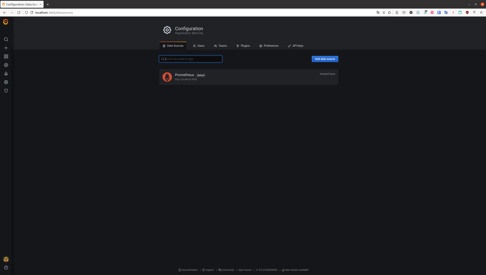
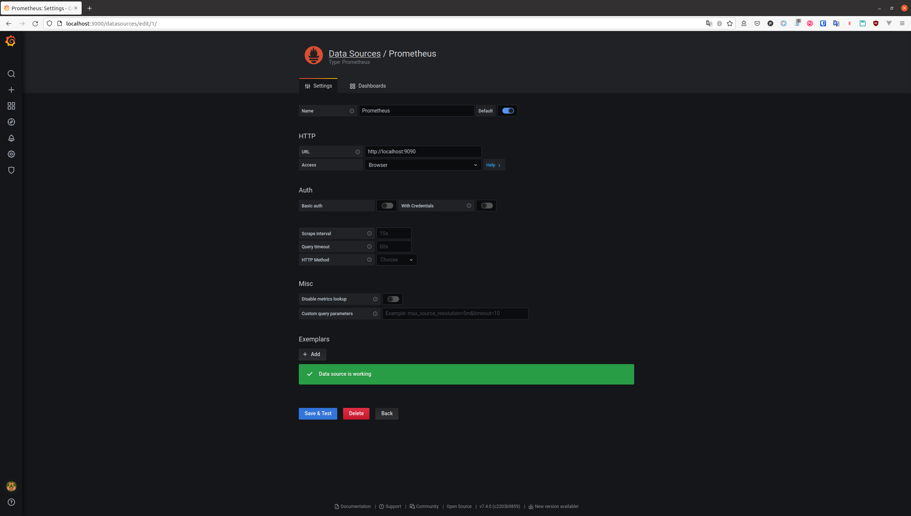
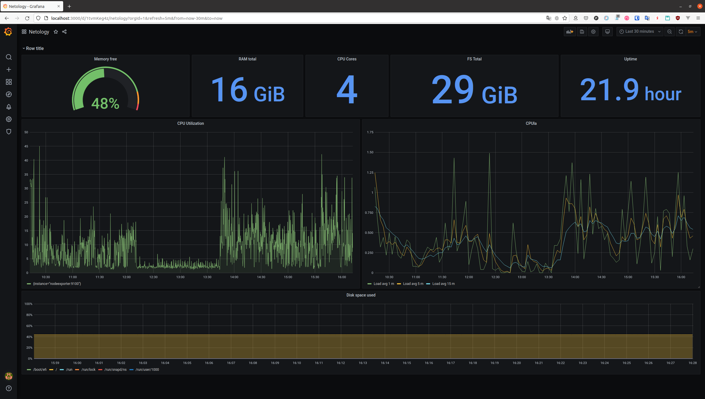
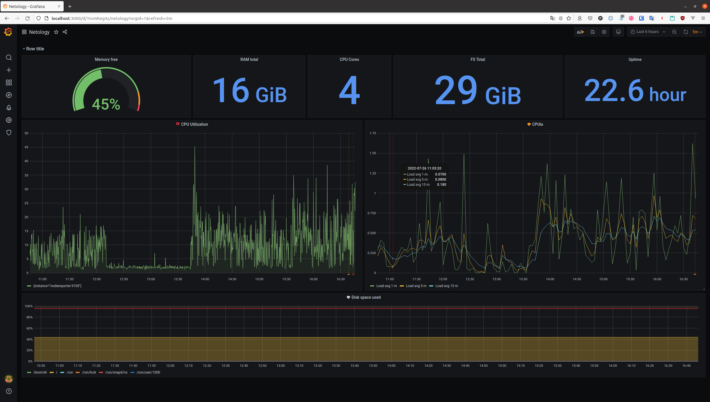

# Результаты домашнего задания "10.03. Grafana"

## Обязательные задания

## Задание 1

:white_check_mark: Используя директорию [help](./help) внутри данного домашнего задания - запустите связку prometheus-grafana.

:white_check_mark: Зайдите в веб-интерфейс графана, используя авторизационные данные, указанные в манифесте docker-compose.

:white_check_mark: Подключите поднятый вами prometheus как источник данных.

:white_check_mark: Решение домашнего задания - скриншот веб-интерфейса grafana со списком подключенных Datasource.

---

### Список подключенных Datasource в Grafana





## Задание 2

:white_check_mark: Изучите самостоятельно ресурсы:

- [promql-for-humans](https://timber.io/blog/promql-for-humans/#cpu-usage-by-instance)
- [understanding prometheus cpu metrics](https://www.robustperception.io/understanding-machine-cpu-usage)

:white_check_mark: Создайте Dashboard и в ней создайте следующие Panels:

- Утилизация CPU для nodeexporter (в процентах, 100-idle)

    ```
        100 - avg by (instance) ((irate(node_cpu_seconds_total{job="nodeexporter",mode="idle"}[$__rate_interval])) * 100)
    ```

- CPULA 1/5/15

    ```
        node_load1{job="nodeexporter"}
        node_load5{job="nodeexporter"}
        node_load15{job="nodeexporter"}
    ```

- Количество свободной оперативной памяти

    ```
        100 * (node_memory_MemTotal_bytes - node_memory_MemAvailable_bytes) / node_memory_MemTotal_bytes
    ```

- Количество места на файловой системе

    ```
        100 - ((node_filesystem_avail_bytes{device!~'rootfs'} * 100) / node_filesystem_size_bytes{device!~'rootfs'})
    ```

:white_check_mark: Для решения данного ДЗ приведите promql запросы для выдачи этих метрик, а также скриншот получившейся Dashboard.

---



## Задание 3

Создайте для каждой Dashboard подходящее правило alert (можно обратиться к первой лекции в блоке "Мониторинг").

Для решения ДЗ - приведите скриншот вашей итоговой Dashboard.

---



## Задание 4

:white_check_mark:  Сохраните ваш Dashboard.

:white_check_mark: Для этого перейдите в настройки Dashboard, выберите в боковом меню "JSON MODEL".

:white_check_mark: Далее скопируйте отображаемое json-содержимое в отдельный файл и сохраните его.

:white_check_mark: В решении задания - приведите листинг этого [файла](./dashboard/netology.json)