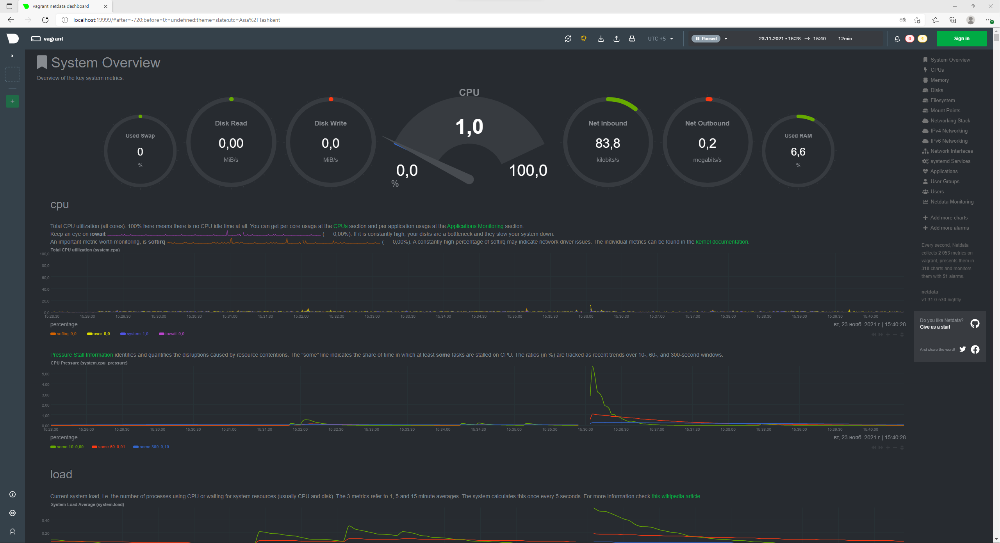

# Результаты домашнего задания к занятию "3.4. Операционные системы, лекция 2"
1. `/etc/systemd/system/node-exporter.service` содержание файла:
    * ```bash
      [Unit]
      Description=The Prometheus Node Exporter exposes a wide variety of hardware- and kernel-related metrics.

      [Service]
      Type=simple
      EnvironmentFile=-/etc/default/node-exporter
      ExecStart=/usr/sbin/node_exporter $NE

      [Install]
      WantedBy=multi-user.target
      ```
    * `/etc/default/node-exporter` содержание файла:
        ```bash
        NE=--version
        ```
    * вывод службы при запуске:
        ```bash
            vagrant@vagrant:~$ sudo systemctl status node-exporter
            ● node-exporter.service - The Prometheus Node Exporter exposes a wide variety of hardware- and kernel-related metrics.
                Loaded: loaded (/etc/systemd/system/node-exporter.service; enabled; vendor preset: enabled)
                Active: active (running) since Tue 2021-11-23 06:42:40 UTC; 1s ago
            Main PID: 1603 (node_exporter)
                Tasks: 4 (limit: 4617)
                Memory: 2.3M
                CGroup: /system.slice/node-exporter.service
                        └─1603 /usr/sbin/node_exporter

            Nov 23 06:42:40 vagrant node_exporter[1603]: ts=2021-11-23T06:42:40.976Z caller=node_exporter.go:115 level=info collector=thermal_zone
            Nov 23 06:42:40 vagrant node_exporter[1603]: ts=2021-11-23T06:42:40.976Z caller=node_exporter.go:115 level=info collector=time
            Nov 23 06:42:40 vagrant node_exporter[1603]: ts=2021-11-23T06:42:40.976Z caller=node_exporter.go:115 level=info collector=timex
            Nov 23 06:42:40 vagrant node_exporter[1603]: ts=2021-11-23T06:42:40.976Z caller=node_exporter.go:115 level=info collector=udp_queues
            Nov 23 06:42:40 vagrant node_exporter[1603]: ts=2021-11-23T06:42:40.976Z caller=node_exporter.go:115 level=info collector=uname
            Nov 23 06:42:40 vagrant node_exporter[1603]: ts=2021-11-23T06:42:40.976Z caller=node_exporter.go:115 level=info collector=vmstat
            Nov 23 06:42:40 vagrant node_exporter[1603]: ts=2021-11-23T06:42:40.976Z caller=node_exporter.go:115 level=info collector=xfs
            Nov 23 06:42:40 vagrant node_exporter[1603]: ts=2021-11-23T06:42:40.976Z caller=node_exporter.go:115 level=info collector=zfs
            Nov 23 06:42:40 vagrant node_exporter[1603]: ts=2021-11-23T06:42:40.976Z caller=node_exporter.go:199 level=info msg="Listening on" address=:9100
            Nov 23 06:42:40 vagrant node_exporter[1603]: ts=2021-11-23T06:42:40.977Z caller=tls_config.go:195 level=info msg="TLS is disabled." http2=false
        ```
2. Ознакомьтесь с опциями node_exporter и выводом /metrics по-умолчанию. Приведите несколько опций, которые вы бы выбрали для базового мониторинга хоста по CPU, памяти, диску и сети.
    * CPU
        ```bash
            node_cpu_seconds_total{cpu="0",mode="idle"} 12640.72           
            node_cpu_seconds_total{cpu="0",mode="system"} 3.85
            node_cpu_seconds_total{cpu="0",mode="user"} 2.83        
        ```
    * Memory
        ```bash
            node_memory_MemAvailable_bytes 3.78146816e+09
            node_memory_MemFree_bytes 3.765235712e+09
            node_memory_MemTotal_bytes 4.127350784e+09

            node_memory_SwapCached_bytes 0
            node_memory_SwapFree_bytes 1.027600384e+09
            node_memory_SwapTotal_bytes 1.027600384e+09
        ```
    * HDD
        ```bash
            node_filesystem_size_bytes{device="/dev/mapper/vgvagrant-root",fstype="ext4",mountpoint="/"} 6.5827115008e+10
            node_filesystem_size_bytes{device="/dev/sda1",fstype="vfat",mountpoint="/boot/efi"} 5.35805952e+08            
            node_filesystem_size_bytes{device="vagrant",fstype="vboxsf",mountpoint="/vagrant"} 1.621438230528e+12

            node_filesystem_free_bytes{device="/dev/mapper/vgvagrant-root",fstype="ext4",mountpoint="/"} 6.416838656e+10
            node_filesystem_free_bytes{device="/dev/sda1",fstype="vfat",mountpoint="/boot/efi"} 5.35801856e+08            
            node_filesystem_free_bytes{device="vagrant",fstype="vboxsf",mountpoint="/vagrant"} 1.366732283904e+12

            node_filesystem_device_error{device="/dev/mapper/vgvagrant-root",fstype="ext4",mountpoint="/"} 0
            node_filesystem_device_error{device="/dev/sda1",fstype="vfat",mountpoint="/boot/efi"} 0
        ```
    * Network
        ```bash
            node_network_up{device="eth0"} 1
            node_network_info{address="08:00:27:73:60:cf",broadcast="ff:ff:ff:ff:ff:ff",device="eth0",duplex="full",ifalias="",operstate="up"} 1

            node_network_transmit_packets_total{device="eth0"} 7279
            node_network_transmit_bytes_total{device="eth0"} 1.059411e+06

            node_network_receive_packets_total{device="eth0"} 9989
            node_network_receive_bytes_total{device="eth0"} 714754

            node_network_speed_bytes{device="eth0"} 1.25e+08

            node_network_mtu_bytes{device="eth0"} 1500
        ```
3. Установите в свою виртуальную машину Netdata.
    * ```bash
        vagrant@vagrant:~$ systemctl status netdata
        ● netdata.service - Real time performance monitoring
            Loaded: loaded (/lib/systemd/system/netdata.service; enabled; vendor preset: enabled)
            Active: active (running) since Tue 2021-11-23 10:36:02 UTC; 7s ago
            Process: 1621 ExecStartPre=/bin/mkdir -p /var/cache/netdata (code=exited, status=0/SUCCESS)
            Process: 1633 ExecStartPre=/bin/chown -R netdata:netdata /var/cache/netdata (code=exited, status=0/SUCCESS)
            Process: 1634 ExecStartPre=/bin/mkdir -p /var/run/netdata (code=exited, status=0/SUCCESS)
            Process: 1635 ExecStartPre=/bin/chown -R netdata:netdata /var/run/netdata (code=exited, status=0/SUCCESS)
        Main PID: 1636 (netdata)
            Tasks: 70 (limit: 4617)
            Memory: 53.6M
            CGroup: /system.slice/netdata.service
                    ├─1636 /usr/sbin/netdata -P /var/run/netdata/netdata.pid -D
                    ├─1642 /usr/sbin/netdata --special-spawn-server
                    ├─1786 bash /usr/libexec/netdata/plugins.d/tc-qos-helper.sh 1
                    ├─1794 /usr/libexec/netdata/plugins.d/ebpf.plugin 1
                    ├─1807 /usr/libexec/netdata/plugins.d/go.d.plugin 1
                    └─1810 /usr/libexec/netdata/plugins.d/apps.plugin 1

        Nov 23 10:36:02 vagrant systemd[1]: Starting Real time performance monitoring...
        Nov 23 10:36:02 vagrant systemd[1]: Started Real time performance monitoring.
        Nov 23 10:36:02 vagrant netdata[1636]: CONFIG: cannot load cloud config '/var/lib/netdata/cloud.d/cloud.conf'. Running with internal defaults.
        Nov 23 10:36:02 vagrant netdata[1636]: 2021-11-23 10:36:02: netdata INFO  : MAIN : CONFIG: cannot load cloud config '/var/lib/netdata/cloud.d/cloud.conf'. Running with internal defaults.
        Nov 23 10:36:02 vagrant ebpf.plugin[1794]: Does not have a configuration file inside `/etc/netdata/ebpf.d.conf. It will try to load stock file.
        Nov 23 10:36:02 vagrant ebpf.plugin[1794]: Name resolution is disabled, collector will not parser "hostnames" list.
        Nov 23 10:36:02 vagrant ebpf.plugin[1794]: The network value of CIDR 127.0.0.1/8 was updated for 127.0.0.0 .
        Nov 23 10:36:02 vagrant ebpf.plugin[1794]: Loaded config file '/etc/netdata/apps_groups.conf'
      ```
    * 
4. Можно ли по выводу dmesg понять, осознает ли ОС, что загружена не на настоящем оборудовании, а на системе виртуализации?
    * ```bash
        vagrant@vagrant:~$ dmesg | grep virtual
        [    0.000993] CPU MTRRs all blank - virtualized system.      
        [    1.984424] systemd[1]: Detected virtualization oracle.
      ```
5. Как настроен sysctl fs.nr_open на системе по-умолчанию? Узнайте, что означает этот параметр. Какой другой существующий лимит не позволит достичь такого числа (ulimit --help)?
    * ```bash
        vagrant@vagrant:~$ sudo sysctl -a | grep fs.nr_
        fs.nr_open = 1048576
      ```
    * `fs.nr_open = 1048576` - максимальное количество дескрипторов файлов, которое может выделить процесс. Значение по умолчанию - 1024 * 1024 (1048576).
    `ulimit -n` не позволит достич такого числа
6. ```bash
        root@vagrant:~# screen
        root@vagrant:~# unshare -f --pid --mount-proc -- bash -c 'ping 8.8.8.8'

        root@vagrant:~# ps aux | grep ping
        root        1817  0.0  0.0   8080   596 pts/1    S+   13:00   0:00 unshare -f --pid --mount-proc -- bash -c ping 8.8.8.8
        root        1818  0.0  0.0   9692   936 pts/1    S+   13:00   0:00 ping 8.8.8.8
        root        1822  0.0  0.0   8900   740 pts/0    S+   13:01   0:00 grep --color=auto ping

        root@vagrant:~# nsenter --target 1818 --pid --mount
        root@vagrant:/# ps aux
        USER         PID %CPU %MEM    VSZ   RSS TTY      STAT START   TIME COMMAND
        root           1  0.0  0.0   9692   936 pts/1    S+   13:00   0:00 ping 8.8.8.8
        root           2  0.0  0.1   9836  4132 pts/0    S    13:02   0:00 -bash
        root          11  0.0  0.0  11492  3308 pts/0    R+   13:02   0:00 ps aux
7. ```bash
        [Tue Nov 23 12:19:37 2021] cgroup: fork rejected by pids controller in /user.slice/user-1000.slice/session-6.scope
   ```
    * Установка ограничения число процессов пользователя `ulimit -u 5`


    