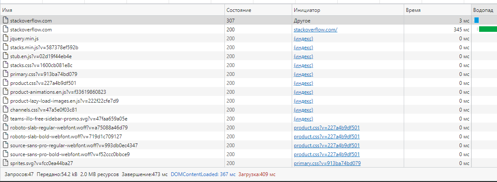

# Результаты домашнего задания к занятию "3.6. Компьютерные сети, лекция 1"
1. Работа c HTTP через телнет.
    * ```bash
        vagrant@vagrant:~$ telnet stackoverflow.com 80
        Trying 151.101.65.69...
        Connected to stackoverflow.com.
        Escape character is '^]'.
        GET /questions HTTP/1.0
        HOST: stackoverflow.com

        HTTP/1.1 301 Moved Permanently
        Cache-Control: no-cache, no-store, must-revalidate
        Location: https://stackoverflow.com/questions
        x-request-guid: d0cbd1de-c8b5-42e2-a64e-ff310abb5737
        feature-policy: microphone 'none'; speaker 'none'
        content-security-policy: upgrade-insecure-requests; frame-ancestors 'self' https://stackexchange.com
        Accept-Ranges: bytes
        Date: Wed, 01 Dec 2021 13:03:26 GMT
        X-Served-By: cache-hhn4080-HHN
        X-Cache: MISS
        X-Cache-Hits: 0
        X-Timer: S1638363807.842267,VS0,VE85
        Vary: Fastly-SSL
        X-DNS-Prefetch-Control: off
        Set-Cookie: prov=bc5196a8-8457-b8f2-c3c6-51c92d3fda64; domain=.stackoverflow.com; expires=Fri, 01-Jan-2055 00:00:00 GMT; path=/; HttpOnly
        X-Cache: MISS from pfgw1
        X-Cache-Lookup: MISS from pfgw1:3128
        Via: 1.1 varnish, ICAP/1.0 pfgw.localdomain (C-ICAP/0.5.8 SquidClamav/Antivirus service ), 1.1 pfgw1 (squid)
        Connection: close

        Connection closed by foreign host.
      ```
    * Полученный код HTTP `301 Moved Permanently`- запрошенный документ был окончательно перенесен на новый URI, указанный в поле Location заголовка
1. Повторите задание 1 в браузере, используя консоль разработчика F12
    * Код состояния: `307 Internal Redirect`
    * Долше всего обрабатывался запрос на URL `https://stackoverflow.com/` - время 345 мс
    * 
1. Мой IP:
    * 
1. Какому провайдеру принадлежит ваш IP адрес? Какой автономной системе AS?
    * ```bash
        % Information related to '195.69.189.0/24AS28910'

        route:          195.69.189.0/24
        *descr:          Intal Telecom JV
        *origin:         AS28910
        mnt-by:         INTAL-MNT
        created:        2009-06-03T10:00:57Z
        last-modified:  2009-06-03T10:00:57Z
        source:         RIPE
      ```
1. Через какие сети проходит пакет, отправленный с вашего компьютера на адрес 8.8.8.8? Через какие AS?
    * ```bash
        vagrant@vagrant:~$ traceroute -An 8.8.8.8
        traceroute to 8.8.8.8 (8.8.8.8), 30 hops max, 60 byte packets
        1  192.168.222.1 [*]  0.178 ms  0.143 ms  0.119 ms
        2  195.69.189.169 [AS28910]  0.665 ms  0.659 ms  0.627 ms
        3  195.69.189.33 [AS28910]  0.782 ms  0.748 ms  0.716 ms
        4  195.69.189.49 [AS28910]  1.104 ms 195.69.189.47 [AS28910]  1.043 ms 195.69.189.49 [AS28910]  1.062 ms
        5  178.18.227.7 [AS50952]  50.344 ms  50.333 ms  53.508 ms
        6  108.170.250.99 [AS15169]  54.217 ms  55.835 ms 108.170.250.66 [AS15169]  55.752 ms
        7  142.251.49.158 [AS15169]  61.527 ms 172.253.66.116 [AS15169]  65.487 ms 142.251.49.24 [AS15169]  70.031 ms
        8  172.253.65.82 [AS15169]  62.355 ms 209.85.254.20 [AS15169]  68.769 ms 72.14.238.168 [AS15169]  69.433 ms
        9  172.253.64.57 [AS15169]  66.654 ms 142.250.209.25 [AS15169]  65.118 ms 216.239.58.67 [AS15169]  64.732 ms
        10  * * *
        11  * * *
        12  * * *
        13  * * *
        14  * * *
        15  * * *
        16  * * *
        17  * * *
        18  * * *
        19  8.8.8.8 [AS15169]  65.059 ms  64.585 ms  67.394 ms
        ```
1. На каком участке наибольшая задержка - delay?
    * ```bash
        vagrant@vagrant:~$ mtr -zn --report 8.8.8.8
        Start: 2021-12-01T19:11:26+0500
        HOST: xxxxxxxxxx                Loss%   Snt   Last   Avg  Best  Wrst StDev
        1. AS???    192.168.222.1        0.0%    10    0.2   0.2   0.2   0.2   0.0
        2. AS28910  195.69.189.169       0.0%    10    1.1   0.8   0.6   1.1   0.2
        3. AS28910  195.69.189.33        0.0%    10    0.8   0.8   0.8   0.9   0.0
        4. AS28910  195.69.189.49        0.0%    10    1.2   1.2   1.0   2.1   0.3
        5. AS56655  178.18.227.7         0.0%    10   48.1  48.2  48.0  48.8   0.2
        6. AS15169  108.170.250.51       0.0%    10   74.7  61.1  48.2  89.2  13.1
        7. AS15169  216.239.51.32       30.0%    10   65.0  65.4  65.0  66.6   0.5
       * 8. AS15169  172.253.66.110       0.0%    10   65.8  65.7  65.4  67.0   0.5
        9. AS15169  142.250.210.47       0.0%    10   64.5  64.1  63.4  64.5   0.5
        10. AS???    ???                 100.0    10    0.0   0.0   0.0   0.0   0.0
        11. AS???    ???                 100.0    10    0.0   0.0   0.0   0.0   0.0
        12. AS???    ???                 100.0    10    0.0   0.0   0.0   0.0   0.0
        13. AS???    ???                 100.0    10    0.0   0.0   0.0   0.0   0.0
        14. AS???    ???                 100.0    10    0.0   0.0   0.0   0.0   0.0
        15. AS???    ???                 100.0    10    0.0   0.0   0.0   0.0   0.0
        16. AS???    ???                 100.0    10    0.0   0.0   0.0   0.0   0.0
        17. AS???    ???                 100.0    10    0.0   0.0   0.0   0.0   0.0
        18. AS15169  8.8.8.8             90.0%    10   64.8  64.8  64.8  64.8   0.0
      ```
    * наибольшая задержка на участке `AS15169  172.253.66.110`
1. Какие DNS сервера отвечают за доменное имя dns.google? Какие A записи?
    * ```bash
        vagrant@vagrant:~$ dig +nocmd dns.google. +noall +answer
        dns.google.		839	IN	A	8.8.8.8
        dns.google.		839	IN	A	8.8.4.4
       ```
1. Проверьте PTR записи для IP адресов из задания 7. Какое доменное имя привязано к IP?
    * ```bash
        vagrant@vagrant:~$ dig +nocmd -x 8.8.8.8 +noall +answer
        8.8.8.8.in-addr.arpa.	85975	IN	PTR	dns.google.
        vagrant@vagrant:~$ dig +nocmd -x 8.8.4.4 +noall +answer
        4.4.8.8.in-addr.arpa.	86223	IN	PTR	dns.google.
      ```


