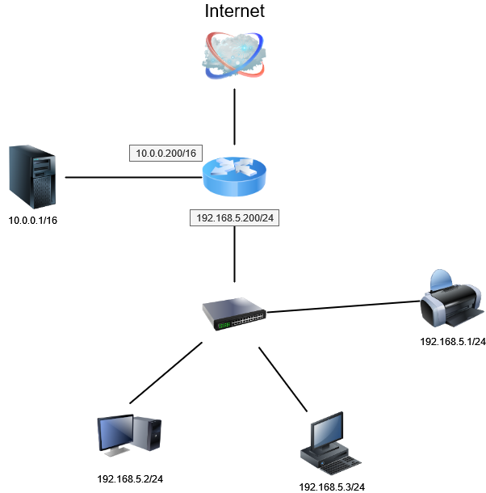

# Результаты домашнего задания к занятию "3.8. Компьютерные сети, лекция 3"
1. Подключитесь к публичному маршрутизатору в интернет. Найдите маршрут к вашему публичному IP
    * ```bash
        route-views>show ip route 195.69.189.173
        Routing entry for 195.69.189.0/24
            Known via "bgp 6447", distance 20, metric 0
            Tag 6939, type external
            Last update from 64.71.137.241 2d12h ago
            Routing Descriptor Blocks:
            * 64.71.137.241, from 64.71.137.241, 2d12h ago
                Route metric is 0, traffic share count is 1
                AS Hops 2
                Route tag 6939
                MPLS label: none
        

        route-views>show ip bgp 195.69.189.0/24 longer-prefixes
        BGP table version is 1413242723, local router ID is 128.223.51.103
        Status codes: s suppressed, d damped, h history, * valid, > best, i - internal,
                    r RIB-failure, S Stale, m multipath, b backup-path, f RT-Filter,
                    x best-external, a additional-path, c RIB-compressed,
        Origin codes: i - IGP, e - EGP, ? - incomplete
        RPKI validation codes: V valid, I invalid, N Not found

            Network          Next Hop            Metric LocPrf Weight Path
        N*   195.69.189.0     208.51.134.254           0             0 3549 3356 28910 i
        N*                    4.68.4.46                0             0 3356 28910 i
        N*                    209.124.176.223                        0 101 6939 28910 i
        N*                    193.0.0.56                             0 3333 31133 28910 i
        N*                    154.11.12.212            0             0 852 6939 28910 i
        N*                    162.251.163.2                          0 53767 6939 28910 i
        N*                    37.139.139.17            0             0 57866 9002 28910 i
        N*                    140.192.8.16                           0 20130 6939 28910 i
        N*                    202.232.0.2                            0 2497 6939 28910 i
        N*                    212.66.96.126                          0 20912 6939 28910 i
        N*                    217.192.89.50                          0 3303 3356 28910 i
        N*                    162.250.137.254                        0 4901 6079 6939 28910 i
            Network          Next Hop            Metric LocPrf Weight Path
        N*                    12.0.1.63                              0 7018 3356 28910 i
        N*                    91.218.184.60            0             0 49788 6939 28910 i
        N*                    94.142.247.3             0             0 8283 31133 28910 i
        N*                    203.62.252.83                          0 1221 4637 6939 28910 i
        N*                    137.39.3.55                            0 701 1273 3216 28910 i
        N*                    89.149.178.10           10             0 3257 28917 28917 28917 43727 210222 28910 i
        N*                    206.24.210.80                          0 3561 3910 3356 28910 i
        N*                    132.198.255.253                        0 1351 6939 28910 i
        N*>                   64.71.137.241                          0 6939 28910 i
      ```
1. Создайте dummy0 интерфейс в Ubuntu. Добавьте несколько статических маршрутов. Проверьте таблицу маршрутизации.
    * ```bash
        vagrant@vagrant:~$ ip -c -br a
        lo               UNKNOWN        127.0.0.1/8 ::1/128
        eth0             UP             10.0.2.15/24 fe80::a00:27ff:fe73:60cf/64
        dummy0           UNKNOWN        10.2.2.2/32 fe80::105e:f5ff:fe5e:31b/64

        vagrant@vagrant:~$ ip -br route
        default via 10.0.2.2 dev eth0 proto dhcp src 10.0.2.15 metric 100
        10.0.2.0/24 dev eth0 proto kernel scope link src 10.0.2.15
        10.0.2.2 dev eth0 proto dhcp scope link src 10.0.2.15 metric 100
        192.168.10.0/24 via 10.2.2.2 dev dummy0
        192.168.50.0/24 dev dummy0 scope link
        192.168.50.0/24 dev dummy0 scope link metric 35
      ```
1. Проверьте открытые TCP порты в Ubuntu, какие протоколы и приложения используют эти порты? Приведите несколько примеров.
    * ```bash
        vagrant@vagrant:~$ ss -4talr
        State                        Recv-Q                       Send-Q                                             Local Address:Port                                                       Peer Address:Port                       Process
        LISTEN                       0                            4096                                                   localhost:8125                                                            0.0.0.0:*
        LISTEN                       0                            4096                                                     0.0.0.0:19999                                                           0.0.0.0:*
        LISTEN                       0                            4096                                                     0.0.0.0:rpc.portmapper                                                  0.0.0.0:*
        LISTEN                       0                            4096                                                localhost%lo:domain                                                          0.0.0.0:*
        LISTEN                       0                            128                                                      0.0.0.0:ssh                                                             0.0.0.0:*
      ```
1. Проверьте используемые UDP сокеты в Ubuntu, какие протоколы и приложения используют эти порты?
    * ```bash
        vagrant@vagrant:~$ ss -ual
        State                         Recv-Q                        Send-Q                                                Local Address:Port                                                 Peer Address:Port                       Process
        UNCONN                        0                             0                                                     127.0.0.53%lo:domain                                                    0.0.0.0:*
        UNCONN                        0                             0                                                    10.0.2.15%eth0:bootpc                                                    0.0.0.0:*
        UNCONN                        0                             0                                                           0.0.0.0:sunrpc                                                    0.0.0.0:*
        UNCONN                        0                             0                                                         127.0.0.1:8125                                                      0.0.0.0:*
        UNCONN                        0                             0                                                              [::]:sunrpc                                                       [::]:*
        UNCONN                        0                             0                                                             [::1]:8125                                                         [::]:*
      ```
1. Используя diagrams.net, создайте L3 диаграмму вашей домашней сети или любой другой сети, с которой вы работали.
    