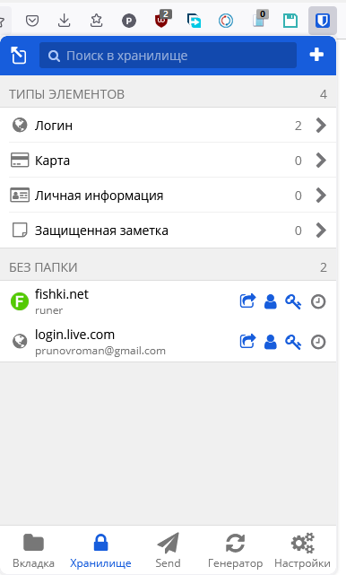
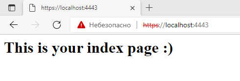
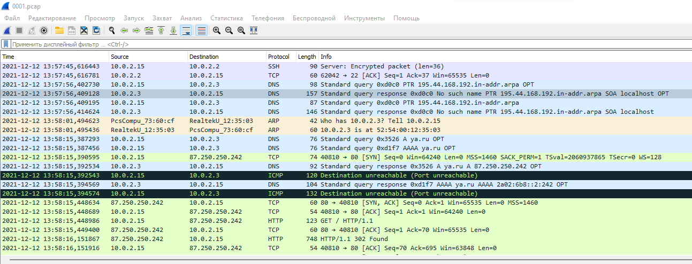

# Результаты домашнего задания к занятию "3.9. Элементы безопасности информационных систем"

1. Установите Bitwarden плагин для браузера. Зарегестрируйтесь и сохраните несколько паролей.

    

1. Установите Google authenticator на мобильный телефон. Настройте вход в Bitwarden акаунт через Google authenticator OTP.

    * Наистроил и выполнил

1. Установите apache2, сгенерируйте самоподписанный сертификат, настройте тестовый сайт для работы по HTTPS.

``` bash
    vagrant@vagrant:~$ systemctl status apache2
    ● apache2.service - The Apache HTTP Server
        Loaded: loaded (/lib/systemd/system/apache2.service; enabled; vendor preset: enabled)
        Active: active (running) since Sun 2021-12-12 09:28:59 UTC; 1min 45s ago
        Docs: https://httpd.apache.org/docs/2.4/
    Main PID: 5465 (apache2)
        Tasks: 55 (limit: 1071)
        Memory: 5.5M
        CGroup: /system.slice/apache2.service
                ├─5465 /usr/sbin/apache2 -k start
                ├─5466 /usr/sbin/apache2 -k start
                └─5467 /usr/sbin/apache2 -k start

    Dec 12 09:28:59 vagrant systemd[1]: Starting The Apache HTTP Server...
    Dec 12 09:28:59 vagrant systemd[1]: Started The Apache HTTP Server.
    ------------------------

    vagrant@vagrant:~$ sudo openssl req -x509 -nodes -days 10 -newkey rsa:2048 -keyout /etc/ssl/private/apache.key -out /etc/ssl/certs/apache.crt

    ------------------------

    vagrant@vagrant:~$ cat /etc/apache2/sites-available/mysite.com.conf
    <VirtualHost *:443>
        DocumentRoot /var/www/mysite

        SSLEngine on
        SSLCertificateFile /etc/ssl/certs/apache.crt
        SSLCertificateKeyFile /etc/ssl/private/apache.key

    </VirtualHost>

    ------------------------

    vagrant@vagrant:~$ openssl x509 -in /etc/ssl/certs/apache.crt -text -noout
    Certificate:
        Data:
            Version: 3 (0x2)
            Serial Number:
                73:d6:3b:14:0f:ae:2b:ec:8f:ac:f8:c2:54:f7:94:dc:c6:85:07:6b
            Signature Algorithm: sha256WithRSAEncryption
            Issuer: C = UZ, ST = Tashkent, L = Tashkent, O = Vagrant, OU = VM, CN = Prunov Roman, emailAddress = prunovroman@gmail.com
            Validity
                Not Before: Dec 12 09:49:31 2021 GMT
                Not After : Dec 22 09:49:31 2021 GMT
            Subject: C = UZ, ST = Tashkent, L = Tashkent, O = Vagrant, OU = VM, CN = Prunov Roman, emailAddress = prunovroman@gmail.com
```



1. Проверьте на TLS уязвимости произвольный сайт в интернете

``` bash
    vagrant@vagrant:/tmp/testssl$ ./testssl.sh -U --sneaky https://player.uz

    Start 2021-12-12 12:52:28        -->> 80.80.208.36:443 (player.uz) <<--

    rDNS (80.80.208.36):    --
    Service detected:       HTTP


    Testing vulnerabilities

    Heartbleed (CVE-2014-0160)                not vulnerable (OK), timed out
    CCS (CVE-2014-0224)                       not vulnerable (OK)
    Ticketbleed (CVE-2016-9244), experiment.  not vulnerable (OK)
    ROBOT                                     not vulnerable (OK)
    Secure Renegotiation (RFC 5746)           supported (OK)
    Secure Client-Initiated Renegotiation     not vulnerable (OK)
    CRIME, TLS (CVE-2012-4929)                not vulnerable (OK)
    BREACH (CVE-2013-3587)                    potentially NOT ok, "gzip" HTTP compression etected. - only supplied "/" tested
                                            Can be ignored for static pages or if no secrets in the page
    POODLE, SSL (CVE-2014-3566)               not vulnerable (OK)
    TLS_FALLBACK_SCSV (RFC 7507)              Downgrade attack prevention supported (OK)
    SWEET32 (CVE-2016-2183, CVE-2016-6329)    VULNERABLE, uses 64 bit block ciphers
    FREAK (CVE-2015-0204)                     not vulnerable (OK)
    DROWN (CVE-2016-0800, CVE-2016-0703)      not vulnerable on this host and port (OK)
                                            make sure you dont use this certificate elsewhere with SSLv2 enabled services
                                            https://censys.io/ipv4?q=A79116ED5A38CED01D4F397298D925E7E63DE2DB0CA3D24AE6C3A46817AE4859 could help you to find out
    LOGJAM (CVE-2015-4000), experimental      common prime with 2048 bits detected: RFC7919/fdhe2048 (2048 bits),
                                            but no DH EXPORT ciphers
    BEAST (CVE-2011-3389)                     TLS1: ECDHE-RSA-AES128-SHA ECDHE-RSA-AES256-SHA HE-RSA-AES128-SHA DHE-RSA-AES256-SHA ECDHE-RSA-DES-CBC3-SHA EDH-RSA-DES-CBC3-SHA AES128-SHA ES256-SHA DES-CBC3-SHA
                                            VULNERABLE -- but also supports higher protocols  TLSv1.1 TLSv1.2 (likely mitigated)
    LUCKY13 (CVE-2013-0169), experimental     potentially VULNERABLE, uses cipher block chaining CBC) ciphers with TLS. Check patches
    Winshock (CVE-2014-6321), experimental    not vulnerable (OK) - CAMELLIA or ECDHE_RSA GCM iphers found
    RC4 (CVE-2013-2566, CVE-2015-2808)        no RC4 ciphers detected (OK)


    Done 2021-12-12 12:53:10 [  45s] -->> 80.80.208.36:443 (player.uz) <<--
```

1. Установите на Ubuntu ssh сервер, сгенерируйте новый приватный ключ. Скопируйте свой публичный ключ на другой сервер. Подключитесь к серверу по SSH-ключу.

``` bash
    vagrant@vagrant:~$ ssh-keygen
    Generating public/private rsa key pair.
    Enter file in which to save the key (/home/vagrant/.ssh/id_rsa):
    Enter passphrase (empty for no passphrase):
    Enter same passphrase again:
    Your identification has been saved in /home/vagrant/.ssh/id_rsa
    Your public key has been saved in /home/vagrant/.ssh/id_rsa.pub
    The key fingerprint is:
    SHA256:sAmoFeAekn5WREmVzX5GhFj8pywE8kcGbNz3SINgntQ vagrant@vagrant
    The key's randomart image is:
    +---[RSA 3072]----+
    |... o+=*%.+.     |
    |.. o.o+B.E =     |
    |ooo ..=o= = +    |
    |+o. .. = + = o   |
    |.o o  o S + o    |
    |  o      . o     |
    |          .      |
    |                 |
    |                 |
    +----[SHA256]-----+
    
    -------------------------------------

    vagrant@vagrant:~$ ssh-copy-id vagrant@192.168.44.199
    /usr/bin/ssh-copy-id: INFO: Source of key(s) to be installed: "/home/vagrant/.ssh/id_rsa.pub"
    /usr/bin/ssh-copy-id: INFO: attempting to log in with the new key(s), to filter out any that are already installed
    /usr/bin/ssh-copy-id: INFO: 1 key(s) remain to be installed -- if you are prompted now it is to install the new keys
    vagrant@192.168.44.199's password:

    Number of key(s) added: 1

    Now try logging into the machine, with:   "ssh 'vagrant@192.168.44.199'"
    and check to make sure that only the key(s) you wanted were added.

```

1.Переименуйте файлы ключей из задания 5. Настройте файл конфигурации SSH клиента, так чтобы вход на удаленный сервер осуществлялся по имени сервера.

``` bash
    vagrant@vagrant:~$ ssh vagrant@vgsrv
    The authenticity of host 'vgsrv (192.168.44.199)' can't be established.
    ECDSA key fingerprint is SHA256:wSHl+h4vAtTT7mbkj2lbGyxWXWTUf6VUliwpncjwLPM.
    Are you sure you want to continue connecting (yes/no/[fingerprint])? yes
    Warning: Permanently added 'vgsrv' (ECDSA) to the list of known hosts.
    vagrant@vgsrv's password:
    Welcome to Ubuntu 20.04.2 LTS (GNU/Linux 5.4.0-80-generic x86_64)

    * Documentation:  https://help.ubuntu.com
    * Management:     https://landscape.canonical.com
    * Support:        https://ubuntu.com/advantage

    System information as of Sun 12 Dec 2021 01:49:23 PM UTC

    System load:  0.0               Processes:             112
    Usage of /:   2.4% of 61.31GB   Users logged in:       1
    Memory usage: 15%               IPv4 address for eth0: 10.0.2.15
    Swap usage:   0%                IPv4 address for eth1: 192.168.44.199


    This system is built by the Bento project by Chef Software
    More information can be found at https://github.com/chef/bento
    Last login: Sun Dec 12 13:45:11 2021 from 192.168.44.195
```

1. Соберите дамп трафика утилитой tcpdump в формате pcap, 100 пакетов. Откройте файл pcap в Wireshark.

``` bash
    vagrant@vagrantserver:~$ sudo tcpdump -w 0001.pcap -c 100 -i eth0
    tcpdump: listening on eth0, link-type EN10MB (Ethernet), capture size 262144 bytes
    100 packets captured
    117 packets received by filter
    0 packets dropped by kernel
```


