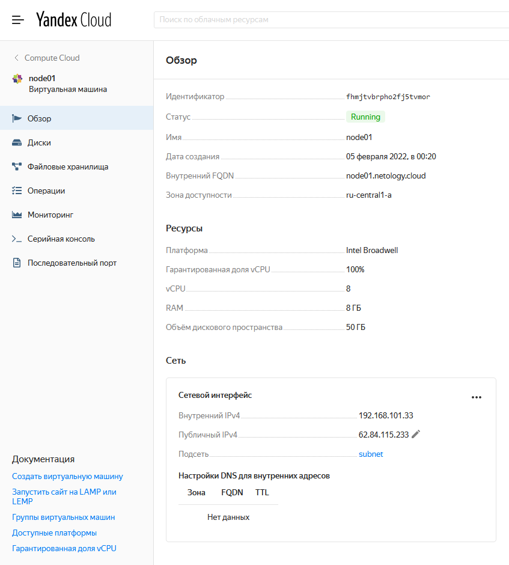
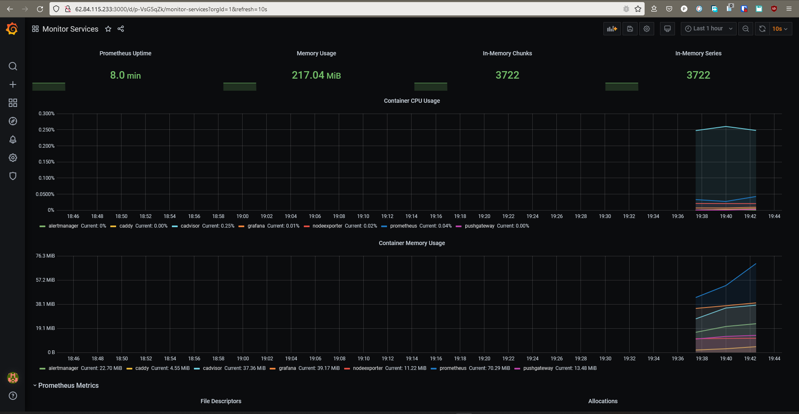

# Результаты домашнего задания "5.4. Оркестрация группой Docker контейнеров на примере Docker Compose"

## Задача 1

Создать собственный образ операционной системы с помощью Packer.

Для получения зачета, вам необходимо предоставить:
- Скриншот страницы, как на слайде из презентации (слайд 37).
---

```bash

vagrant@server1:~$ yc init

yc config list
token: AQAAAABc8lcNAATuwc4y4R9enU9sqcZmSf6eNdE
cloud-id: b1gnb1ash1r268j80skq
folder-id: b1gq7904qrcdni1hovad
compute-default-zone: ru-central1-a

vagrant@server1:~$ yc vpc network create --name net --labels my-label=netology-net-pr
id: enpjsg82fodarqrr5ver
folder_id: b1gq7904qrcdni1hovad
created_at: "2022-02-04T18:09:54Z"
name: net
labels:

vagrant@server1:~$ yc vpc subnet create --name my-subnet-a --zone ru-central1-a --range 10.1.2.0/24 --network-name net --description "my first subnet via yc"
id: e9bdg1sjejpb0n3pc8lp
folder_id: b1gq7904qrcdni1hovad
created_at: "2022-02-04T18:13:01Z"
name: my-subnet-a
description: my first subnet via yc
network_id: enpjsg82fodarqrr5ver
zone_id: ru-central1-a
v4_cidr_blocks:
- 10.1.2.0/24

vagrant@server1:~$ packer build centos-7-base.json
yandex: output will be in this color.
....
Build 'yandex' finished after 2 minutes 22 seconds.

vagrant@server1:~$ yc compute image list
+----------------------+---------------+--------+----------------------+--------+
|          ID          |     NAME      | FAMILY |     PRODUCT IDS      | STATUS |
+----------------------+---------------+--------+----------------------+--------+
| fd8q5qdbkd3l12ofggna | centos-7-base | centos | f2eacrudv331nbat9ehb | READY  |
+----------------------+---------------+--------+----------------------+--------+

```

## Задача 2

Создать вашу первую виртуальную машину в Яндекс.Облаке.

---



## Задача 3

Создать ваш первый готовый к боевой эксплуатации компонент мониторинга, состоящий из стека микросервисов.


