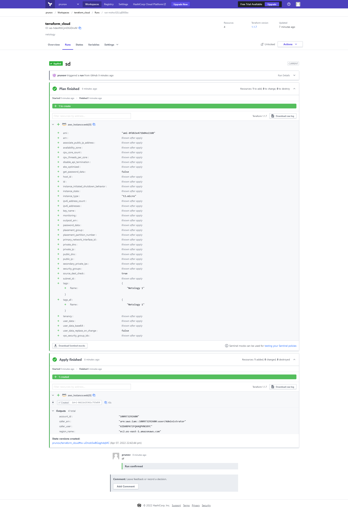

# Результаты домашнего задания "7.4. Средства командной работы над инфраструктурой."

## Задача 1. Настроить terraform cloud (необязательно, но крайне желательно)

В это задании предлагается познакомиться со средством командой работы над инфраструктурой предоставляемым
разработчиками терраформа

1. Зарегистрируйтесь на [https://app.terraform.io/](https://app.terraform.io/).
(регистрация бесплатная и не требует использования платежных инструментов).
1. Создайте в своем github аккаунте (или другом хранилище репозиториев) отдельный репозиторий с
 конфигурационными файлами прошлых занятий (или воспользуйтесь любым простым конфигом).
1. Зарегистрируйте этот репозиторий в [https://app.terraform.io/](https://app.terraform.io/).
1. Выполните plan и apply

В качестве результата задания приложите снимок экрана с успешным применением конфигурации.

---

Ссылка на конфигурацию terraform для облака <https://github.com/prunovr/terraform_cloud>

Снимок экрана:



## Задача 2. Написать серверный конфиг для атлантиса

Смысл задания – познакомиться с документацией о [серверной](https://www.runatlantis.io/docs/server-side-repo-config.html) конфигурации и конфигурации уровня [репозитория](https://www.runatlantis.io/docs/repo-level-atlantis-yaml.html).

Создай `server.yaml` который скажет атлантису:

1. Укажите, что атлантис должен работать только для репозиториев в вашем github (или любом другом) аккаунте.
1. На стороне клиентского конфига разрешите изменять `workflow`, то есть для каждого репозитория можно
будет указать свои дополнительные команды.
1. В `workflow` используемом по-умолчанию сделайте так, что бы во время планирования не происходил `lock` состояния.

Создай `atlantis.yaml` который, если поместить в корень terraform проекта, скажет атлантису:

1. Надо запускать планирование и аплай для двух воркспейсов `stage` и `prod`.
1. Необходимо включить автопланирование при изменении любых файлов `*.tf`.

В качестве результата приложите ссылку на файлы `server.yaml` и `atlantis.yaml`.

---

Ссылка на серверный и клиентский конфиг: <https://github.com/prunovr/devops-netology/tree/main/vagrant/7.4/atlantis>  

## Задача 3. Знакомство с каталогом модулей

1. В [каталоге модулей](https://registry.terraform.io/browse/modules) найдите официальный модуль от aws для создания `ec2` инстансов.
2. Изучите как устроен модуль. Задумайтесь, будете ли в своем проекте использовать этот модуль или непосредственно
ресурс `aws_instance` без помощи модуля?
3. В рамках предпоследнего задания был создан ec2 при помощи ресурса `aws_instance`.
Создайте аналогичный инстанс при помощи найденного модуля.

В качестве результата задания приложите ссылку на созданный блок конфигураций.

---

1. Нашел официальный модуль от AWS EC2 <https://registry.terraform.io/modules/terraform-aws-modules/ec2-instance/aws/latest>.
1. Изучил данный модуль. Если потребуется создавать одну и туже структуру только с изменениями некоторых паратмеров. то да буду использовать модули, для этого они и предназначены.
1. Ссылка <https://github.com/prunovr/devops-netology/tree/main/vagrant/7.4/terraform_as_module>
    - terraform plan

    ```bash
      vagrant@vagrant:~/terraform_modules/tr_modul$ terraform plan

      Terraform used the selected providers to generate the following execution plan. Resource actions are indicated with the following symbols:

      - create

      Terraform will perform the following actions:

      # module.ec2-instance["vm1"].aws_instance.this[0] will be created

      - resource "aws_instance" "this" {
        - ami                                  = "ami-0fd63e471b04e22d0"
        - arn                                  = (known after apply)
        - associate_public_ip_address          = (known after apply)
        - availability_zone                    = (known after apply)
        - cpu_core_count                       = (known after apply)
        - cpu_threads_per_core                 = (known after apply)
        - disable_api_termination              = (known after apply)
        - ebs_optimized                        = (known after apply)
        - get_password_data                    = false
        - host_id                              = (known after apply)
        - id                                   = (known after apply)
        - instance_initiated_shutdown_behavior = (known after apply)
        - instance_state                       = (known after apply)
        - instance_type                        = "t2.small"
        - ipv6_address_count                   = (known after apply)
        - ipv6_addresses                       = (known after apply)
        - key_name                             = (known after apply)
        - monitoring                           = true
        - outpost_arn                          = (known after apply)
        - password_data                        = (known after apply)
        - placement_group                      = (known after apply)
        - placement_partition_number           = (known after apply)
        - primary_network_interface_id         = (known after apply)
        - private_dns                          = (known after apply)
        - private_ip                           = (known after apply)
        - public_dns                           = (known after apply)
        - public_ip                            = (known after apply)
        - secondary_private_ips                = (known after apply)
        - security_groups                      = (known after apply)
        - source_dest_check                    = true
        - subnet_id                            = (known after apply)
        - tags                                 = {
          - "Name" = "app-server-vm1"
              }
        - tags_all                             = {
          - "Name" = "app-server-vm1"
              }
        - tenancy                              = (known after apply)
        - user_data                            = (known after apply)
        - user_data_base64                     = (known after apply)
        - user_data_replace_on_change          = false
        - volume_tags                          = {
          - "Name" = "app-server-vm1"
              }
        - vpc_security_group_ids               = [
          - "sg-0c3a866a7df722c37",
              ]

        - capacity_reservation_specification {
          - capacity_reservation_preference = (known after apply)

          - capacity_reservation_target {
            - capacity_reservation_id = (known after apply)
                  }
              }

        - credit_specification {}

        - ebs_block_device {
          - delete_on_termination = (known after apply)
          - device_name           = (known after apply)
          - encrypted             = (known after apply)
          - iops                  = (known after apply)
          - kms_key_id            = (known after apply)
          - snapshot_id           = (known after apply)
          - tags                  = (known after apply)
          - throughput            = (known after apply)
          - volume_id             = (known after apply)
          - volume_size           = (known after apply)
          - volume_type           = (known after apply)
              }

        - enclave_options {
          - enabled = (known after apply)
              }

        - ephemeral_block_device {
          - device_name  = (known after apply)
          - no_device    = (known after apply)
          - virtual_name = (known after apply)
              }

        - metadata_options {
          - http_endpoint               = "enabled"
          - http_put_response_hop_limit = 1
          - http_tokens                 = "optional"
          - instance_metadata_tags      = "disabled"
              }

        - network_interface {
          - delete_on_termination = (known after apply)
          - device_index          = (known after apply)
          - network_interface_id  = (known after apply)
              }

        - root_block_device {
          - delete_on_termination = (known after apply)
          - device_name           = (known after apply)
          - encrypted             = (known after apply)
          - iops                  = (known after apply)
          - kms_key_id            = (known after apply)
          - tags                  = (known after apply)
          - throughput            = (known after apply)
          - volume_id             = (known after apply)
          - volume_size           = (known after apply)
          - volume_type           = (known after apply)
              }

        - timeouts {}
          }

      # module.ec2-instance["vm2"].aws_instance.this[0] will be created

      - resource "aws_instance" "this" {
        - ami                                  = "ami-0fd63e471b04e22d0"
        - arn                                  = (known after apply)
        - associate_public_ip_address          = (known after apply)
        - availability_zone                    = (known after apply)
        - cpu_core_count                       = (known after apply)
        - cpu_threads_per_core                 = (known after apply)
        - disable_api_termination              = (known after apply)
        - ebs_optimized                        = (known after apply)
        - get_password_data                    = false
        - host_id                              = (known after apply)
        - id                                   = (known after apply)
        - instance_initiated_shutdown_behavior = (known after apply)
        - instance_state                       = (known after apply)
        - instance_type                        = "t2.large"
        - ipv6_address_count                   = (known after apply)
        - ipv6_addresses                       = (known after apply)
        - key_name                             = (known after apply)
        - monitoring                           = true
        - outpost_arn                          = (known after apply)
        - password_data                        = (known after apply)
        - placement_group                      = (known after apply)
        - placement_partition_number           = (known after apply)
        - primary_network_interface_id         = (known after apply)
        - private_dns                          = (known after apply)
        - private_ip                           = (known after apply)
        - public_dns                           = (known after apply)
        - public_ip                            = (known after apply)
        - secondary_private_ips                = (known after apply)
        - security_groups                      = (known after apply)
        - source_dest_check                    = true
        - subnet_id                            = (known after apply)
        - tags                                 = {
          - "Name" = "app-server-vm2"
              }
        - tags_all                             = {
          - "Name" = "app-server-vm2"
              }
        - tenancy                              = (known after apply)
        - user_data                            = (known after apply)
        - user_data_base64                     = (known after apply)
        - user_data_replace_on_change          = false
        - volume_tags                          = {
          - "Name" = "app-server-vm2"
              }
        - vpc_security_group_ids               = [
          - "sg-0c3a866a7df722c37",
              ]

        - capacity_reservation_specification {
          - capacity_reservation_preference = (known after apply)

          - capacity_reservation_target {
            - capacity_reservation_id = (known after apply)
                  }
              }

        - credit_specification {}

        - ebs_block_device {
          - delete_on_termination = (known after apply)
          - device_name           = (known after apply)
          - encrypted             = (known after apply)
          - iops                  = (known after apply)
          - kms_key_id            = (known after apply)
          - snapshot_id           = (known after apply)
          - tags                  = (known after apply)
          - throughput            = (known after apply)
          - volume_id             = (known after apply)
          - volume_size           = (known after apply)
          - volume_type           = (known after apply)
              }

        - enclave_options {
          - enabled = (known after apply)
              }

        - ephemeral_block_device {
          - device_name  = (known after apply)
          - no_device    = (known after apply)
          - virtual_name = (known after apply)
              }

        - metadata_options {
          - http_endpoint               = "enabled"
          - http_put_response_hop_limit = 1
          - http_tokens                 = "optional"
          - instance_metadata_tags      = "disabled"
              }

        - network_interface {
          - delete_on_termination = (known after apply)
          - device_index          = (known after apply)
          - network_interface_id  = (known after apply)
              }

        - root_block_device {
          - delete_on_termination = (known after apply)
          - device_name           = (known after apply)
          - encrypted             = (known after apply)
          - iops                  = (known after apply)
          - kms_key_id            = (known after apply)
          - tags                  = (known after apply)
          - throughput            = (known after apply)
          - volume_id             = (known after apply)
          - volume_size           = (known after apply)
          - volume_type           = (known after apply)
              }

        - timeouts {}
          }

      Plan: 2 to add, 0 to change, 0 to destroy.
    ```
